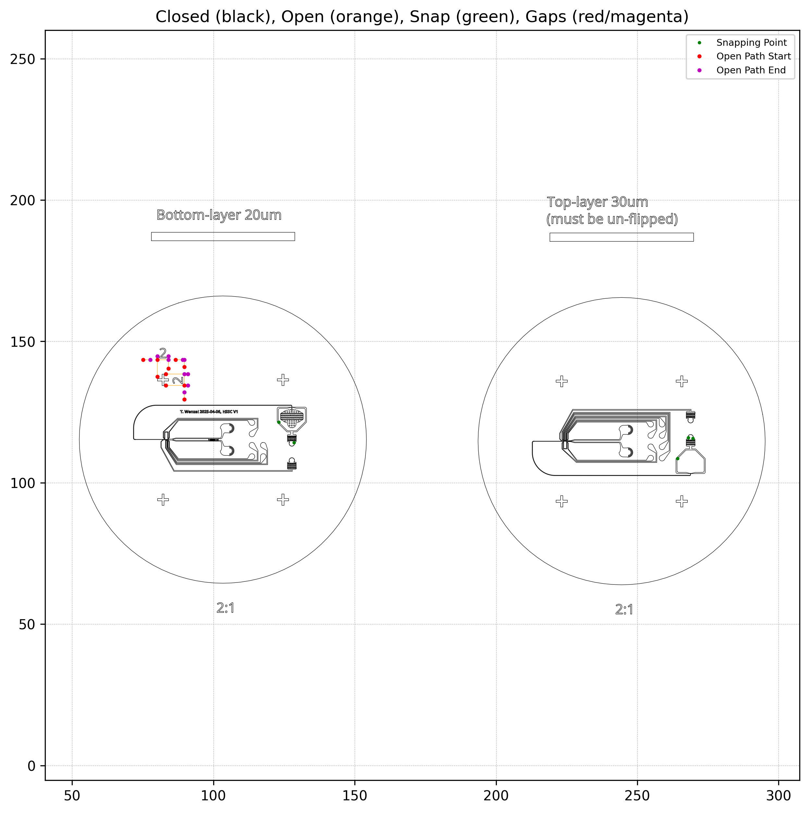
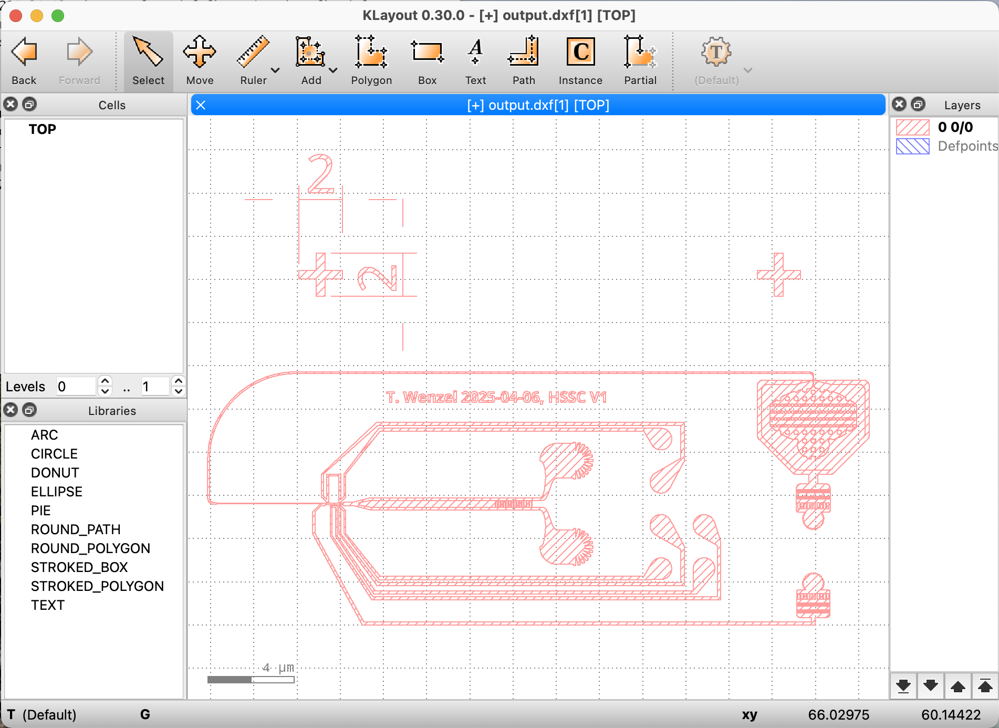
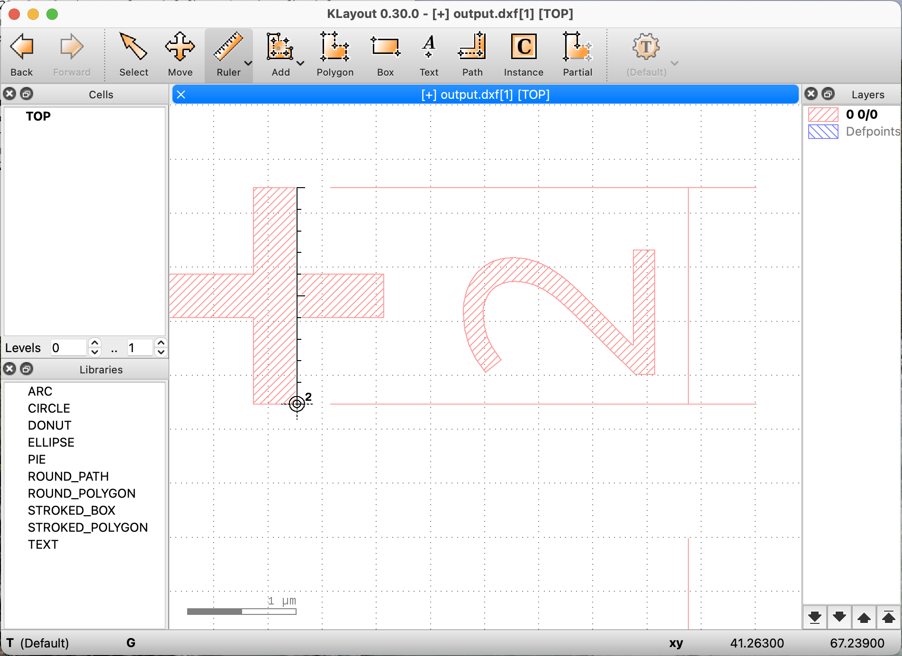
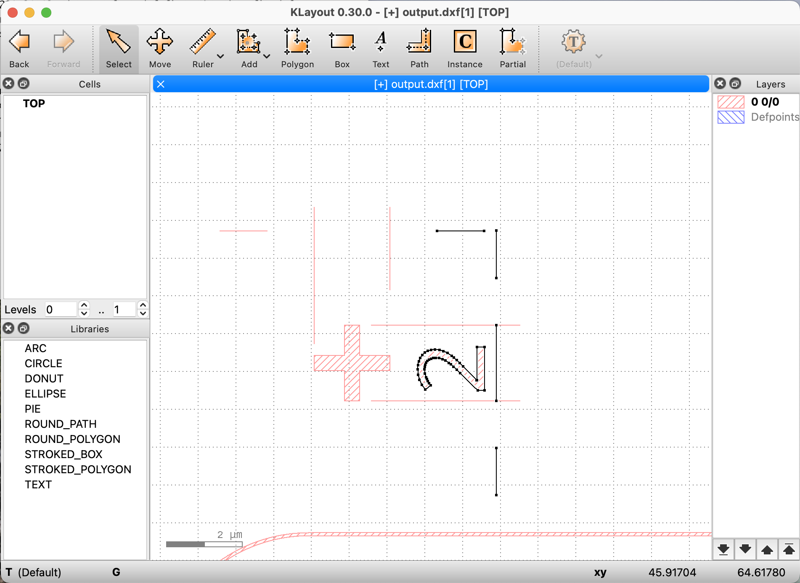

# dxf-fix [](https://github.com/ellerbrock/open-source-badges/)

**dxf-fix** is a Python command-line tool to clean and reconstruct DXF files for photolithography and other precision manufacturing workflows. It flattens arcs and splines into straight segments, snaps nearly-coincident endpoints with micrometer precision, removes duplicate segments, and reconstructs closed, independent shapes using clean `LWPOLYLINE`s.

Many CAD tools export DXF files with curves and loosely connected endpoints, which:
- Prevent proper nesting or shape detection in lithography tools like KLayout, and even more importantly the control softwares that power laser cutters, photoplotters, mask service providers and maskl-less lithography equipment
- Cause rendering artifacts or missing features
- Require manual editing to unify and simplify structures

**dxf-fix** automates the cleanup process and ensures your layout geometry is robust and ready for downstream applications.

## Features

- Flattens `LINE`, `ARC`, `CIRCLE`, `POLYLINE`, and `LWPOLYLINE` entities into line segments
- Snaps endpoints using KD-tree clustering with tunable micrometer precision
- Deduplicates symmetric segments (e.g., (A, B) == (B, A))
- Reconstructs independent closed paths from raw segments
- Outputs clean `LWPOLYLINE`s suitable for fabrication and visualization
- Provides a high-resolution debug overlay image to inspect snapping behavior
- Falls back to saving open paths as `LINE`s when closure is not possible
- Optionally scales and flips the output geometry

## Installation

Install Python 3.9+ and required packages using pip:

```bash
pip install ezdxf matplotlib scipy
```

### Optional: Create an Isolated Environment with Mamba / Micromamba

If you'd prefer to isolate the dependencies using `mamba` or `micromamba`, you can create and activate an environment like this:

```bash
mamba create -n dxf-fix python=3.10 ezdxf matplotlib scipy
mamba activate dxf-fix
```

Then, run the script as usual:

```bash
python fix_dxf.py input.dxf output.dxf
```

## Usage

Run the tool from the command line:

```bash
python fix_dxf.py input.dxf output.dxf
```

- `input.dxf`: input DXF file (e.g., exported from Onshape)
- `output.dxf`: cleaned DXF file with reconstructed shapes

You can configure snapping precision and additional output transformation parameters at the top of the script:

```python
DEFAULT_UNIT = "mm"
DEFAULT_PRECISION_UM = 0.1
DEFAULT_ARC_SEGMENTS = 100
OUTPUT_SCALE = 1.0  # Set to e.g. 0.5 to reduce the size by half
FLIP_Y = False      # Set to True to vertically flip the output
```

These transformation options are useful when:
- Your DXF export is scaled differently (e.g., 2:1 or 10:1)
- You need to mirror the layout vertically for lithography or alignment purposes

## Output

- A cleaned DXF file with closed `LWPOLYLINE`s
- - Any open paths that could not be closed will be written as `LINE`s
- A diagnostic image `reconstruction_overlay.png` showing snapping and open paths, see example below:

<p align="left">

</p>

## Verification and Editing

We recommend to view the output DXF file visually in the open source [KLayout software](https://www.klayout.de/build.html), also [on GitHub](https://github.com/KLayout/klayout). The viewer hatches closed areas nicely which indicates that lines are indeed closed and ready for the lithography machine or mask service. 
<p align="left">

</p>

You can double check that the final scale in micrometer of features in your file is correct by using the "Ruler" tool to measure an edge of known size.
<p align="left">

</p>

Switch the software opening mode to "edit mode" in order to delete lables you might not need.
<p align="left">

</p>

## License and Attribution

This project is licensed under the BSD 3-Clause License. See the LICENSE file for details.

It has been developed by Tobias Wenzel – Wenzel Lab. If you use this tool in academic work, please consider citing relevant lab publications or linking back to this repository.
